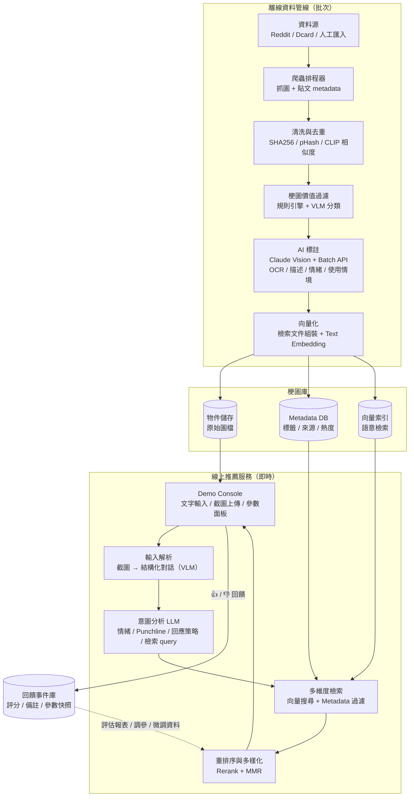
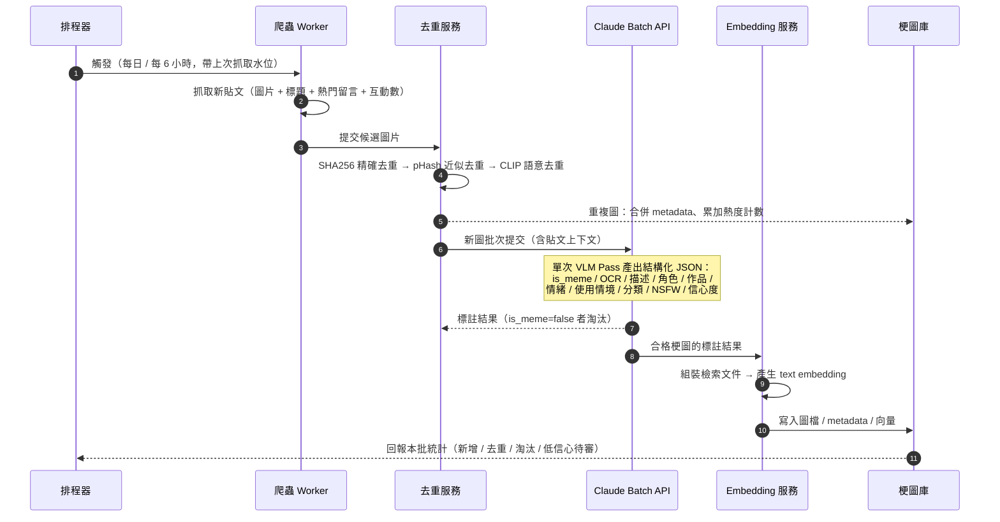
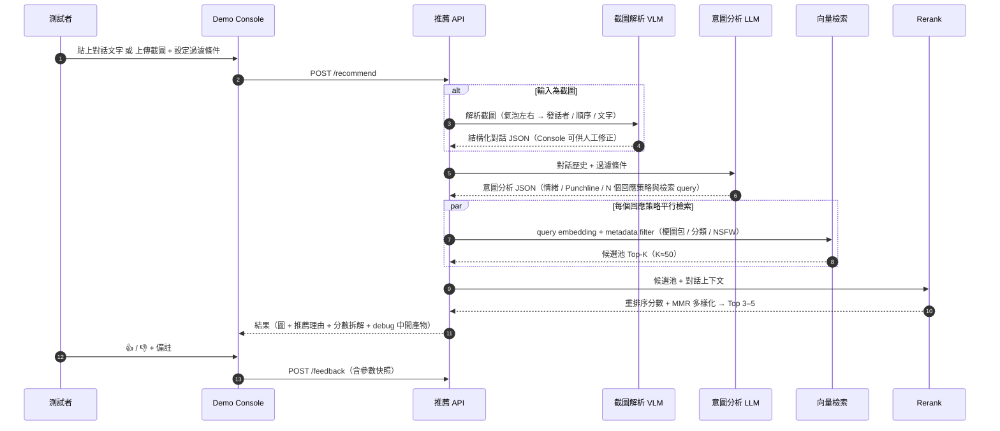
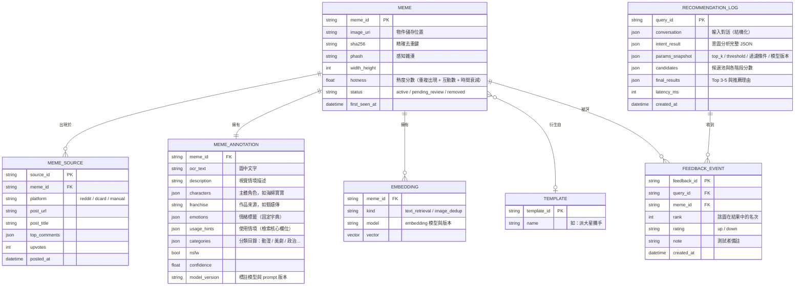

# 系統架構與技術選型

> 本文件描述 MemeRadar 的整體架構、資料流、模組間介面契約與技術 / 模型選型。依需求，後端框架與資料庫**不做最終定案**，以「建議候選」標示；AI 模型與演算法層則給出明確建議。

## 1. 架構總覽

系統分成兩條主線：**離線資料管線**（爬蟲 → 理解 → 索引，批次執行）與**線上推薦服務**（對話輸入 → 意圖分析 → 檢索排序 → 展示回饋，即時執行）。兩者透過「梗圖庫」（物件儲存 + 結構化 metadata + 向量索引）銜接；Console 的回饋事件回流至評估與調參。



## 2. 離線批次流程（爬取 → 入庫）



## 3. 線上推薦流程（對話 → Top 5）



## 4. 資料模型（概念層）

> 僅描述實體與關聯，不綁定特定資料庫。



## 5. 模組間介面契約（概念版）

### 5.1 標註輸出（Understanding 模組 → 梗圖庫）

```jsonc
{
  "meme_id": "m_01H...",
  "is_meme": true,
  "ocr_text": "我就爛",
  "description": "海綿寶寶攤手站立，表情理直氣壯，配上大字「我就爛」",
  "characters": ["海綿寶寶"],
  "franchise": "海綿寶寶",
  "emotions": ["擺爛", "理直氣壯"],
  "usage_hints": [
    "被指責能力不足或偷懶時，理直氣壯地自嘲認了",
    "拒絕改進、表達躺平態度"
  ],
  "categories": ["卡通動畫"],
  "nsfw": false,
  "confidence": 0.93,
  "model_version": "labeler-v1@claude-opus-4-8"
}
```

### 5.2 推薦 API（Console → 線上服務）

```jsonc
// POST /recommend
{
  "input_type": "text",                    // text | screenshot
  "conversation": [                         // input_type=text 時提供
    {"speaker": "other", "text": "你報告又遲交了！"},
    {"speaker": "me",    "text": "抱歉抱歉"},
    {"speaker": "other", "text": "每次都這樣，你到底行不行"}
  ],
  "image": "<base64>",                     // input_type=screenshot 時提供
  "filters": {
    "franchises": ["海綿寶寶", "甄嬛傳"],  // 空陣列 = 不限
    "categories": [],
    "exclude_nsfw": true
  },
  "params": {
    "top_n": 5,                             // 回傳張數 3–5
    "candidate_k": 50,                      // 向量檢索候選池大小
    "min_similarity": 0.35,                 // 相似度下限
    "diversity": 0.5                        // MMR λ，0=只看相關性 1=最大化多樣性
  }
}

// Response
{
  "query_id": "q_01H...",
  "intent": { "...": "意圖分析完整 JSON，見 04 文件" },
  "results": [
    {
      "meme_id": "m_01H...",
      "image_url": "...",
      "rank": 1,
      "scores": {"vector": 0.82, "rerank": 0.91, "final": 0.89},
      "matched_strategy": "滑跪求饒",
      "matched_tags": ["滑跪", "求饒", "認錯"],
      "reason": "對方處於憤怒且重複指責的情境，此圖的使用情境「犯錯被抓包時誇張下跪求饒」與所選回應策略高度吻合"
    }
  ],
  "debug": { "queries": ["..."], "candidates": ["..."], "timings_ms": {"...": 0} }
}
```

## 6. 技術與模型選型

### 6.1 AI 模型（明確建議）

| 用途 | 建議 | 理由與備註 |
|------|------|-----------|
| 圖片標註（OCR + 描述 + 標籤，單一 VLM pass） | **Claude `claude-opus-4-8`** via Messages API + **structured outputs**（`output_config.format` 保證合法 JSON） | 高解析視覺（長邊 2576px）、繁中 OCR 與網路文化理解俱佳；一次 pass 同時完成 OCR / 描述 / 情緒 / 情境，免去自建 OCR pipeline。批次標註走 **Batch API（費用 −50%）**，共用 system prompt 搭配 **prompt caching** |
| 標註成本降級選項 | `claude-sonnet-5` 或 `claude-haiku-4-5` 做第一層「是否梗圖 / NSFW」粗篩 | 是否採用由團隊依成本評估決定；預設全程 opus。粗篩淘汰非梗圖後，昂貴的完整標註只跑合格圖 |
| 截圖解析（對話結構還原） | Claude `claude-opus-4-8`（vision + structured outputs） | 需辨識氣泡左右方（自己 / 對方）、順序、時間戳，是結構化理解不只是 OCR |
| 意圖分析（線上、即時） | Claude `claude-opus-4-8` + structured outputs | 品質敏感路徑；輸出多策略檢索 query。延遲若成瓶頸再評估降級 |
| Rerank | 首選 **LLM listwise rerank**（Claude 對候選 20–30 張的標註摘要打分）；備選 Voyage `rerank` 系列模型 | LLM rerank 可同時產出「推薦理由」文字，一石二鳥 |
| Text Embedding（檢索主軸） | 候選一：**Voyage AI**（Anthropic 官方推薦的 embedding 夥伴，多語系佳）；候選二：**BGE-M3**（開源自架、中文強、零 API 成本） | 以介面封裝（`embed(texts) -> vectors`）便於 A/B 切換；embedding 模型版本必須記錄在向量 metadata，換模型 = 全量重建索引 |
| Image Embedding（去重 / 以圖搜圖） | 開源 **CLIP / SigLIP**（自架推論即可） | 僅用於去重與相似圖聚合，非檢索主軸 |
| OCR 輔助驗證（可選） | PaddleOCR（開源，繁中佳） | 僅在 VLM OCR 抽樣品質不達標時引入交叉驗證，預設不用 |

### 6.2 基礎設施（候選建議，暫不定案）

| 層 | 候選 | 備註 |
|----|------|------|
| 主要語言 | Python 3.11+ | AI / 爬蟲生態最完整 |
| 爬蟲框架 | `httpx` + `PRAW`（Reddit 官方 API）+ `Playwright`（動態頁面） | 見 02 文件 |
| 批次排程 | 先 cron / APScheduler，量大再上 Prefect | Demo 階段不需要重型 workflow 引擎 |
| 後端 API | FastAPI（候選） | async、pydantic schema 與本設計高度契合 |
| Metadata DB + 向量索引 | 候選：PostgreSQL + pgvector（單庫搞定 metadata filter + 向量）；或 Qdrant（過濾語法與量級擴展較佳） | **暫不定案**；Demo 量級（<10 萬張）兩者皆遠遠夠用 |
| 物件儲存 | 本機磁碟 →（未來）S3 相容儲存 | Demo 階段本機即可 |
| 前端 Console | React + Vite + Tailwind（候選）；最速備選 Streamlit | 見 05 文件的取捨分析 |

### 6.3 選型原則

1. **可替換性**：embedding、向量庫、rerank 皆以 thin interface 封裝，任何一項都能在一天內換掉重測。
2. **版本可追溯**：標註 prompt、模型 ID、embedding 模型全部寫入資料列（`model_version`），否則日後無法做一致性評估與增量重標。
3. **成本意識但不過早優化**：Demo 階段以品質為先（預設 opus），等 golden set 建立後再用數據決定哪些環節可降級。
