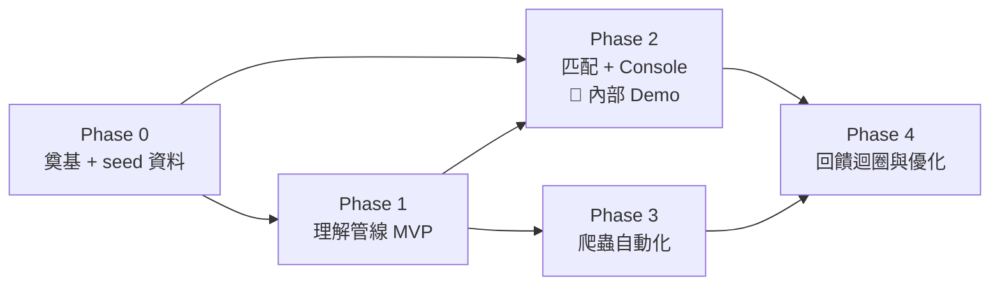

# MemeRadar 開發任務列表

> 依據 [00-overview.md](00-overview.md) 至 [06-risks-and-challenges.md](06-risks-and-challenges.md) 規格展開。
> 排序原則（見 00 文件設計原則 2）：**先用人工 seed 資料把「標註 → 索引 → 匹配 → Console」端到端打通並可評估，爬蟲自動化放後面**。
> 規模估計：S ≤ 0.5 天、M ≈ 1–2 天、L ≈ 3–5 天。

## Phase 0 — 奠基（可與 Phase 1 部分並行）

- [x] **P0-1** 專案初始化：repo 結構（`ingestion/ understanding/ matching/ console/ shared/`）、Python 3.11 環境、設定與 secrets 管理（`ANTHROPIC_API_KEY` 等）、lint / test 骨架 — **S**
  - 驗收：`make test`（無 make 的環境為等價指令 `python -m pytest`）綠燈、README 有啟動說明 ✅
- [x] **P0-2** 標籤 Taxonomy v1 定稿：情緒字典、策略錨點、分類目錄、franchise 正規化表初版（03 文件 §2.3）— **S**
  - 驗收：taxonomy 以資料檔（yaml/json）落在 repo，標註與意圖兩端引用同一份 ✅（`memeradar/shared/data/taxonomy.yaml` + `shared/taxonomy.py` 載入器）
- [ ] **P0-3** 人工 seed 資料集：蒐集 150–300 張精選梗圖，**按策略錨點配平**（每情境 ≥ 8 張），海綿寶寶 / 甄嬛傳兩包優先配足（各 ≥ 30 張）；附來源紀錄 — **L**（可多人分攤、與 P1 並行）
  - 驗收：入庫腳本可重複執行 ✅（`memeradar/ingestion/seed_import.py`，sha256 去重、冪等重跑、每資料夾配平報表）；蒐圖與配平統計 ⏳ 待人工蒐集
- [x] **P0-4** 資料模型落地：依 01 文件 §4 建 schema（先用 SQLite/Postgres 皆可，物件儲存用本機目錄），含 `model_version` 等版本欄位 — **M**
  - 驗收：migration 腳本 + 種子資料寫讀測試 ✅（`memeradar/shared/{db,models,repository}.py` + `migrations/0001_initial.sql`，11 項寫讀測試；概念模型的 TEMPLATE 實體 v1 簡化為 `template_name` 欄位）

## Phase 1 — 理解管線 MVP（目標：一句話能查回合理的 Top-10）

- [ ] **P1-1** 標註器：Claude `claude-opus-4-8` + structured outputs 的單圖標註（03 文件 §2 schema），含貼文上下文注入與重試 — **M**（依賴 P0-2, P0-4）
  - 驗收：seed 集全量跑通，structured output 零解析失敗
  - 進度：標註器已實作並通過測試 ✅（`memeradar/understanding/annotator.py`：taxonomy 動態 enum 進 JSON schema、上下文注入、pending_review 規則、CLI 批次）；「seed 集全量跑通」⏳ 待 P0-3 蒐圖 + 設定 `ANTHROPIC_API_KEY`
- [ ] **P1-2** Batch API 批次標註管線：斷點續跑（已標註不重複計費）、prompt caching、失敗重排 — **M**（依賴 P1-1）
  - 驗收：中斷後重啟不重複送件；成本記錄輸出
- [ ] **P1-3** 標註 Golden Set：人工精標 100 張 + 回歸評估腳本（is_meme 準確率 / 情緒 F1 / OCR 錯字率 / usage_hint 抽評）— **M**（依賴 P0-3）
  - 驗收：03 文件 §7 門檻達標；一鍵重跑
- [x] **P1-4** 檢索文件組裝 + embedding 介面封裝（✅ 已定案 BGE-M3 本地為主；介面保留可換 Voyage）— **M**（依賴 P1-1）
  - 驗收：`embed()` 可切換後端 ✅（Embedder 介面 + 後端註冊表，測試以雙後端驗證並存）；模板與模型版本入庫 ✅（簽名 `bge-m3|doc-v1` 寫入 embeddings.model；真實 BGE-M3 煙霧測試通過，1024 維、語意方向正確）
- [x] **P1-5** 向量索引 + metadata 過濾（✅ Q1 定案：SQLite 單庫 + 程式內餘弦，`VectorSearcher` 介面保留升級路徑）— **M**（依賴 P1-4）
  - 驗收：Top-K + franchise/category/nsfw 過濾查詢通過整合測試 ✅（`memeradar/matching/search.py`，12 項整合測試：Top-K 排序、閾值、別名正規化過濾、JSON 分類過濾、NSFW 開關、組合過濾、下架/待審/非梗圖/異簽名排除、維度檢查）
- [ ] **P1-6** CLI 檢索驗證工具：一句話 query → Top-10（含分數與標籤）— **S**（依賴 P1-5）
  - 驗收：團隊肉眼驗證 20 組 query 合理；embedding A/B 結論記錄於 docs
  - 進度：工具已完成 ✅（`python -m memeradar.matching.cli`，含過濾參數 / 空結果診斷 / --show-doc；真 BGE-M3 煙霧：3 張假梗圖上語意排序與簡體別名過濾皆正確）；embedding A/B 因 Q2 成本決策直接定案 BGE-M3 而免做；「20 組 query 肉眼驗證」⏳ 待 P0-3 seed 資料

## Phase 2 — 匹配模組 + Demo Console（目標：可對外 Demo）

- [ ] **P2-1** 意圖分析：對話 → 意圖 JSON（04 文件 §2.2），含敏感情境偵測與 prompt injection 防護 — **M**（依賴 P0-2）
  - 驗收：20 組測試對話輸出人工評查通過；敏感組零嘲諷策略
- [ ] **P2-2** 多路檢索 + 合併：每策略平行檢索、去重合併、參數化（04 文件 §2.3、§3）— **M**（依賴 P1-5, P2-1）
- [ ] **P2-3** Rerank + MMR + 推薦理由（LLM listwise；決策 Q3 在此實測）— **M**（依賴 P2-2）
  - 驗收：延遲預算內；同模板限量 1 張生效
- [ ] **P2-4** 推薦 API（FastAPI）：`/recommend`、`/feedback`，`RECOMMENDATION_LOG` / `FEEDBACK_EVENT` 落庫（01 文件 §5.2 契約）— **M**（依賴 P2-3）
  - 驗收：契約測試通過；文字輸入端到端 ≤ 8s
- [ ] **P2-5** 截圖解析：VLM 氣泡解析 → 結構化對話（04 文件 §2.1），截圖不落庫 — **M**（依賴 P2-4）
  - 驗收：LINE / Messenger 各 10 張，speaker 準確率 ≥ 90%
- [ ] **P2-6** Console 主頁（React + Vite）：輸入區（含解析預覽編輯）、參數面板、結果卡片 + 👍👎、Debug 面板（05 文件 §2.1）— **L**（依賴 P2-4；UI 骨架可先行）
  - 驗收：05 文件 §5 全項
- [ ] **P2-7** Console 次頁：查詢歷史（含重放）、梗圖庫瀏覽 + 手動上傳 — **M**（依賴 P2-6）
- [ ] **P2-8** 匹配 Golden Set：50–100 組「對話 → 可接受梗圖集合」+ Recall@5 / MRR 評估腳本 — **M**（依賴 P0-3）
  - 驗收：基準數字產出並記錄；Recall@5 ≥ 60% 為 Demo 門檻
- [ ] **P2-9** 🎯 **里程碑：內部 Demo**——範例對話一鍵展示、指定梗圖包過濾、截圖上傳全流程

## Phase 3 — 爬蟲自動化（目標：庫規模 ≥ 3,000 張且品質不降）

- [ ] **P3-1** Adapter 框架 + Reddit adapter（PRAW、水位增量、候選 schema）— **M**（依賴 P0-4）
- [ ] **P3-2** Dcard adapter（節流、UA、失敗告警）— **M**（依賴 P3-1 框架）
- [ ] **P3-3** 去重三層漏斗：SHA256 / pHash / CLIP + 人工佇列 + 熱度累加（02 文件 §4）— **L**（依賴 P3-1）
  - 驗收：02 文件 §8 測試組全過；「同模板不同字」不誤殺
- [ ] **P3-4** 規則引擎價值過濾 + 批次報表（02 文件 §5–6）— **S**（依賴 P3-1）
- [ ] **P3-5** 排程整合：cron 觸發「抓取 → 去重 → 過濾 → Batch 標註 → 入索引」全自動管線 — **M**（依賴 P3-2, P3-3, P3-4, P1-2）
  - 驗收：連續 7 天無人工介入，批次報表數字對帳
- [ ] **P3-6** KnowYourMeme / memes.tw adapter（模板知識補充，選做）— **M**
- [ ] **P3-7** 規模化驗證：庫達 3,000 張後重跑匹配 golden set，確認 Recall 不降、延遲不爆 — **S**（依賴 P3-5, P2-8）

## Phase 4 — 回饋迴圈與優化

- [ ] **P4-1** 回饋報表頁：👍 率趨勢、按參數 / 策略 / franchise 分組、👎 備註歸因五類（06 文件 §3.6）— **M**（依賴 P2-7）
- [ ] **P4-2** 人工複核佇列頁：`pending_review` 標註審核 + 去重裁決 — **M**（依賴 P2-7）
- [ ] **P4-3** 熱度衰減上線：hotness 公式 + 每日重算 job + 排序端接入（06 文件 §3.1）— **M**（依賴 P3-3）
- [ ] **P4-4** 回饋驅動調優第一輪：以 ≥ 500 筆回饋歸因結果調 rerank prompt / 參數預設值，golden set 前後對照 — **M**（依賴 P4-1）
- [ ] **P4-5** 消融實驗：策略展開 / rerank / 熱度各自貢獻度量測，砍掉無貢獻環節 — **S**（依賴 P2-8）
- [ ] **P4-6** Hybrid search 評估（選做，僅當關鍵詞漏召回明顯）— **M**
- [ ] **P4-7** 微調路線評估（決策 Q5）：回饋資料整理為訓練格式、成本效益分析 — **M**（依賴 P4-4）

## 相依關係總覽

## 決策點對照（詳見 06 文件 §4）

| 決策 | 綁定任務 |
|------|---------|
| Q1 向量庫選型 | P1-5 |
| Q2 embedding 選型 | P1-4 / P1-6 |
| Q3 rerank 方案 | P2-3 |
| Q4 FB 人工匯入工具化 | Phase 3 檢討 |
| Q5 微調路線 | P4-7 |
